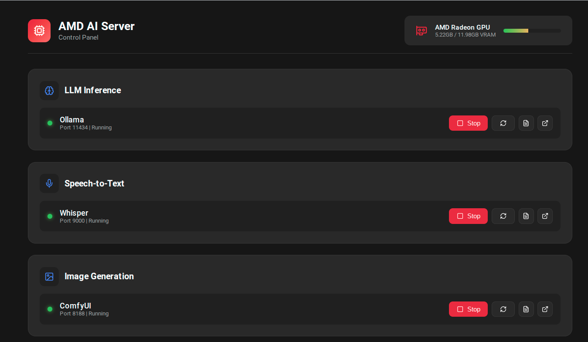

# AMD AI Server Stack



Docker Compose configurations for running AI workloads on AMD GPUs with ROCm.

## Overview

This repository provides a modular, Docker-based approach to deploying AI services on AMD hardware. Rather than managing complex conda environments and dependency conflicts, each service runs in its own container with ROCm GPU acceleration.

### Why Docker for AMD AI?

AMD users face unique challenges compared to NVIDIA:
- Fewer pre-built wheels and packages
- ROCm version compatibility issues
- PyTorch builds often conflict across tools

Docker solves this by:
- Isolating dependencies per service
- Using official ROCm-enabled images
- Enabling reproducible deployments
- Avoiding "disk bloat" from multiple PyTorch installations

## System Requirements

### Hardware (Reference System)

| Component | Specification |
|-----------|---------------|
| GPU | AMD Radeon RX 7700 XT / 7800 XT (Navi 32, gfx1101) |
| VRAM | 12 GB |
| CPU | Intel Core i7-12700F (20 threads) |
| RAM | 64 GB |
| Storage | ~40GB+ free for Docker images and models |

### Software

- Docker with GPU support
- ROCm installed on host (`/opt/rocm`)
- User in `video` and `render` groups
- Device nodes: `/dev/kfd`, `/dev/dri/renderD128`

## Services

### LLM Inference

| Service | Port | Image | Description |
|---------|------|-------|-------------|
| Ollama | 11434 | `ollama/ollama:rocm` | LLM inference server |

### Speech Services

| Service | Port | Description |
|---------|------|-------------|
| Whisper | 9000 | GPU-accelerated speech-to-text (large-v3-turbo) |
| Chatterbox TTS | 8880 | Natural-sounding text-to-speech with voice cloning |

### Image Generation

| Service | Port | Description |
|---------|------|-------------|
| ComfyUI | 8188 | Node-based image generation and manipulation |

### Management

| Service | Port | Description |
|---------|------|-------------|
| Control Panel | 8090 | Web UI for managing services, viewing logs, GPU stats |

### Development (Optional)

| Service | Port | Description |
|---------|------|-------------|
| PyTorch ROCm | - | Base environment for ML tasks (dev profile only) |

## Quick Start

### Option A: Use Pre-built Images (Recommended)

The fastest way to get started - no building required:

```bash
git clone --recurse-submodules https://github.com/danielrosehill/AMD-AI-Server.git
cd AMD-AI-Server

# Copy example environment file and edit paths
cp .env.example .env
nano .env

# Pull and start all services
docker compose -f docker-compose.hub.yml up -d
```

**Pre-built images on Docker Hub:**
- `danielrosehill/amd-ai-whisper:latest` - Whisper STT with ROCm
- `danielrosehill/amd-ai-chatterbox:latest` - Chatterbox TTS with ROCm
- `danielrosehill/amd-ai-control-panel:latest` - Web control panel

### Option B: Build Locally

If you want to customize or build from source:

```bash
git clone --recurse-submodules https://github.com/danielrosehill/AMD-AI-Server.git
cd AMD-AI-Server

# Copy example environment file
cp .env.example .env

# Edit paths for your system
nano .env

# Build and start (takes longer, downloads ROCm base images)
docker compose up -d --build
```

### 2. Start Services

```bash
# Start all services
./scripts/start.sh

# Or start individual services
./scripts/start.sh ollama
./scripts/start.sh whisper
./scripts/start.sh comfyui
```

### 3. Install System Integration (Optional)

Install the systemd service for autostart and desktop menu entry:

```bash
./scripts/install.sh
```

This will:
- Install a systemd service that starts the stack on boot
- Add "AMD AI Server" to your application menu (opens control panel)

To remove:
```bash
./scripts/uninstall.sh
```

### 4. Verify GPU Access

```bash
./scripts/check-gpu.sh
```

## Directory Structure

```
AMD-AI-Server/
├── README.md
├── CLAUDE.md                    # AI agent context
├── .env.example                 # Environment template
├── docker-compose.yml           # Main orchestration file
├── docker-compose.hub.yml       # Pre-built images from Docker Hub
├── control-panel/               # Web UI for service management
│   ├── app.py
│   ├── Dockerfile
│   └── templates/
├── mcp-server/                  # MCP server for Claude integration
│   └── local_ai_mcp/
├── stacks/
│   ├── ollama/
│   │   └── docker-compose.yml
│   ├── whisper/
│   │   ├── docker-compose.yml
│   │   └── Dockerfile
│   ├── chatterbox/              # Text-to-speech (git submodule)
│   │   ├── Chatterbox-TTS-Server/
│   │   ├── config.yaml
│   │   └── data/
│   ├── comfyui/
│   │   └── docker-compose.yml
│   └── pytorch/
│       └── docker-compose.yml
├── scripts/
│   ├── start.sh                 # Start services
│   ├── stop.sh                  # Stop services
│   ├── check-gpu.sh             # Verify GPU access
│   ├── status.sh                # Show service status
│   ├── install.sh               # Install systemd service & desktop entry
│   └── uninstall.sh             # Remove system integration
├── systemd/
│   └── amd-ai-server.service    # Systemd service file
├── desktop/
│   └── amd-ai-server.desktop    # Desktop menu entry
└── docs/
    ├── CUSTOMIZATION.md         # Adapting for your system
    └── TROUBLESHOOTING.md       # Common issues
```

## Configuration

### Environment Variables

Create a `.env` file (see `.env.example`):

```bash
# Host paths for model storage
MODELS_BASE=/home/youruser/ai/models
OLLAMA_MODELS=${MODELS_BASE}/gguf
STT_MODELS=${MODELS_BASE}/stt
TTS_MODELS=${MODELS_BASE}/tts

# GPU configuration (gfx1101 for RX 7700/7800 XT)
HSA_OVERRIDE_GFX_VERSION=11.0.1
ROCM_PATH=/opt/rocm
HIP_VISIBLE_DEVICES=0
PYTORCH_ROCM_ARCH=gfx1101
```

### GPU Environment Variables

These are critical for gfx1101 (Navi 32) GPUs:

| Variable | Value | Purpose |
|----------|-------|---------|
| `HSA_OVERRIDE_GFX_VERSION` | `11.0.1` | ROCm compatibility for gfx1101 |
| `ROCM_PATH` | `/opt/rocm` | ROCm installation path |
| `HIP_VISIBLE_DEVICES` | `0` | GPU selection |
| `PYTORCH_ROCM_ARCH` | `gfx1101` | PyTorch GPU architecture |

## Usage Examples

### Ollama

```bash
# List models
docker exec ollama-rocm ollama list

# Pull a model
docker exec ollama-rocm ollama pull llama3.2

# Run inference
docker exec ollama-rocm ollama run llama3.2 "Hello!"

# API access
curl http://localhost:11434/api/generate -d '{
  "model": "llama3.2",
  "prompt": "Why is the sky blue?"
}'
```

### Whisper STT

```bash
# Health check
curl http://localhost:9000/health

# Transcribe audio
curl -X POST -F 'file=@audio.mp3' http://localhost:9000/transcribe

# With language hint
curl -X POST -F 'file=@audio.mp3' -F 'language=en' http://localhost:9000/transcribe
```

### Chatterbox TTS

```bash
# Web UI
open http://localhost:8880

# API docs
open http://localhost:8880/docs

# Generate speech via API
curl -X POST http://localhost:8880/tts \
  -H "Content-Type: application/json" \
  -d '{"text": "Hello, this is a test.", "voice": "default"}' \
  --output speech.wav
```

Features:
- Zero-shot voice cloning (5 seconds of audio)
- Emotion control
- OpenAI-compatible API
- Audiobook-scale text processing

### ComfyUI

1. Open http://localhost:8188 in browser
2. Load or create workflows
3. All existing models and custom nodes are available

### Control Panel

Access the web-based control panel at http://localhost:8090 for:
- Starting/stopping individual services
- Viewing container logs
- Monitoring GPU memory usage
- Quick links to service web UIs

## MCP Server Integration

The stack includes an MCP server (`mcp-server/`) that provides Claude with direct access to local AI services.

### Available Tools

| Tool | Description |
|------|-------------|
| `transcribe_raw` | Transcribe audio using large-v3-turbo |
| `transcribe_finetune` | Transcribe using fine-tuned Whisper model |
| `transcribe_clean` | Transcribe + Ollama cleanup (fixes punctuation, removes fillers) |
| `whisper_health` | Check Whisper service status |

### Setup

```bash
cd mcp-server
uv venv && source .venv/bin/activate && uv pip install -e .
```

### Configuration

Add to your Claude Desktop or Claude Code config:

```json
{
  "mcpServers": {
    "local-ai": {
      "command": "/path/to/mcp-server/.venv/bin/python",
      "args": ["-m", "local_ai_mcp.server"],
      "env": {
        "WHISPER_URL": "http://localhost:9000",
        "OLLAMA_URL": "http://localhost:11434",
        "OLLAMA_MODEL": "llama3.2"
      }
    }
  }
}
```

## Performance

Expected performance on RX 7700 XT / 7800 XT (12GB VRAM):

| Task | Performance |
|------|-------------|
| LLM (7B models) | 20-40 tokens/sec |
| Whisper (base) | ~10x realtime |
| Whisper (large-v3) | ~2-3x realtime |
| SDXL image gen | ~15-20 sec/image |

## Troubleshooting

### GPU Not Detected

```bash
# Check host GPU
ls -la /dev/kfd /dev/dri/render*

# Verify user groups
groups $USER | grep -E 'video|render'

# Check ROCm
rocm-smi --showproductname
```

### Container Won't Start

```bash
# Check logs
docker logs ollama-rocm
docker logs whisper-rocm

# Verify environment
docker exec ollama-rocm env | grep HSA
```

### Out of Memory

- Reduce model size (use smaller quantizations)
- Enable `--low-vram` flags where available
- Run fewer concurrent services

## Adapting for Your System

See [docs/CUSTOMIZATION.md](docs/CUSTOMIZATION.md) for:
- Modifying paths for your filesystem
- Adjusting for different AMD GPUs (gfx values)
- Adding new services
- Memory and performance tuning

## Contributing

Contributions welcome, especially:
- Configurations for other AMD GPUs
- Additional ROCm-compatible services
- Performance optimizations
- Documentation improvements

## License

MIT License - See [LICENSE](LICENSE) for details.

## Acknowledgments

- [ROCm](https://rocm.docs.amd.com/) - AMD's GPU compute platform
- [Ollama](https://ollama.ai/) - Local LLM inference
- [OpenAI Whisper](https://github.com/openai/whisper) - Speech recognition
- [ComfyUI](https://github.com/comfyanonymous/ComfyUI) - Image generation
- [Chatterbox TTS](https://github.com/resemble-ai/chatterbox) by [Resemble AI](https://www.resemble.ai/) - Text-to-speech model
- [Chatterbox-TTS-Server](https://github.com/devnen/Chatterbox-TTS-Server) by devnen - TTS API server wrapper
